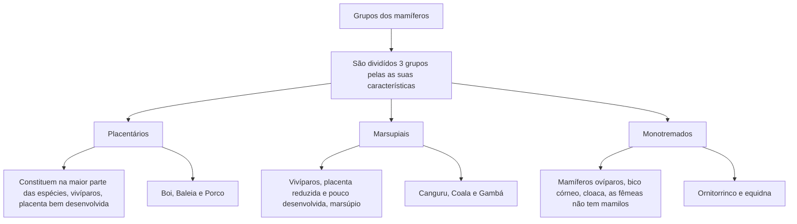

# Trabalho Mamíferos

## Grupos

| Nome             |                                                                                                   Características                                                                                                   |                                                         Exemplos |
| :--------------- | :-----------------------------------------------------------------------------------------------------------------------------------------------------------------------------------------------------------------: | ---------------------------------------------------------------: |
| **Placentários** |                                                              Constituem a maioria das espécies. São **vivíparos** e têm **placenta bem desenvolvida**.                                                              | Cachorro, gato, boi, cavalo, porco, baleia, morcego, ser humano. |
| **Marsupiais**   | São **vivípiros**, com **placenta reduzida e pouco desenvolvida**. Apresentam uma **dobra de pele no abdome, com aspecto de bolsa**(**marsúpio**), onde o **filhote completa o desenvolvimento após o nascimento**. |                                          Canguru, coala e gambá. |
| **Monotremados** |                        São **mamíferos ovíparos**, **sem placenta**, com **bico córneo** e **cloaca**. **As fêmeas não tem mamilo** e o **leite escorre entre os pelos da barriga da mãe**.                         |                                          Ornitorrinco e equidna. |

## Mapa Mental

## Falas

- > Os mamíferos de acordo suas características podem ser divididos em 3 grupos.

- > Esses grupos são: Placentários, Marsupiais e os Monotremados.

- > Os Placentários são a maioria, vivíparos com a placenta bem desenvolvida.

- > Alguns exemplos deles são: Cachorro, Gato e Morcego.

- > Os Marsupiais são vivíparos, tem a placenta pouca desenvolvida e reduzida, apresentam uma dobra de pele parecida com uma bolsa chamada marsúpio, nela o filhote completa o desenvolvimento após nascer.

- > Alguns exemplos deles são: Canguru, Coala e Gambá.

- > Os Monotremados são mamíferos ovíparos, tem um bico córneo e cloaca. Como as fêmeas não tem mamilos, o leite escorre entre os pelos da mãe.

- > Alguns exemplos de Monotremados são: Onirtorrinco e equidna

## Fontes:

> [Wikipédia](https://pt.wikipedia.org/)

    
Wikipédia

    
https://pt.wikipedia.org/

